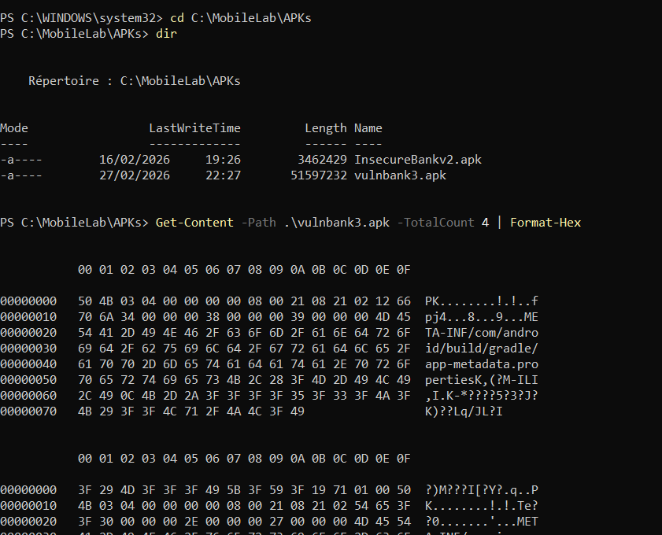
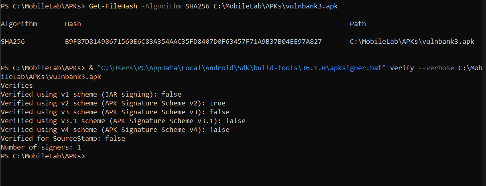
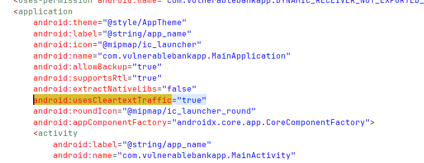
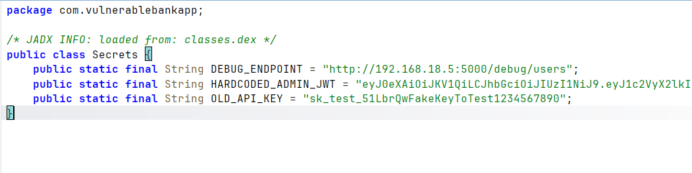
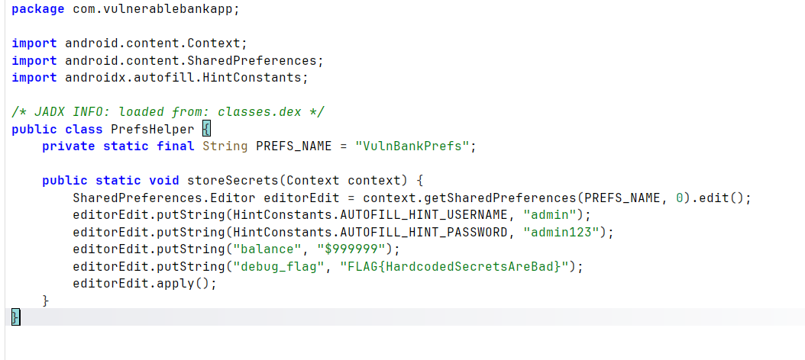
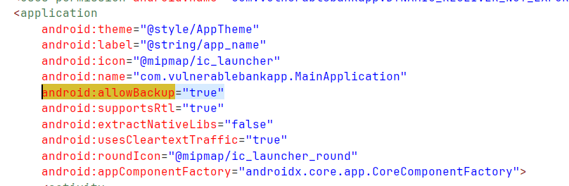

# Rapport d'analyse statique - VulnBank

## Informations générales
- **Date d'analyse :** 27/02/2026
- **Analyste :** Yassir Nacir
- **APK analysé :** VulnBank.apk
- **Provenance :** Application volontairement vulnérable destinée à l’apprentissage de la sécurité mobile
- **Outils utilisés :** JADX GUI, dex2jar, JD-GUI

---

## Résumé exécutif

Cette analyse statique a révélé plusieurs vulnérabilités critiques dans l’application VulnBank.  
Les principales préoccupations concerne la présence de secrets et identifiants codés en dur dans le code source, l’autorisation du trafic HTTP non chiffré et le stockage de données sensibles en clair dans les SharedPreferences.

Le niveau de risque global est évalué comme **élevé**.

### Actions prioritaires recommandées :

1. Supprimer tous les secrets codés en dur dans l’APK.
2. Forcer l’utilisation exclusive de HTTPS et désactiver le cleartext traffic.
3. Sécuriser le stockage local des données sensibles.

---

## Contexte et environnement de travail

Ce lab a pour objectif de se familiariser avec les outils d’analyse statique d’applications Android.  
Cette première analyse permet de comprendre la structure interne d’un fichier APK et d’identifier les risques potentiels avant l’exécution de l’application, afin de prévenir d’éventuels impacts graves en production.

L’APK analysé est **VulnBank**, une application volontairement vulnérable conçue pour les ingénieurs en sécurité, les testeurs d’intrusion et les apprenants en sécurité mobile.

L’application a été installée dans une **AVD (Google Pixel 5 – API 30)** afin de travailler dans un environnement isolé et sécurisé, évitant tout risque pour un appareil personnel.

Avant de lancer n'importe quelle outils, il est nécessaire de vérifier l’intégrité de l’APK de test, placé dans un dossier de travail créé spécifiquement pour ce lab. Il faut s’assurer que l’APK est bien une archive ZIP, lister son contenu, puis calculer et vérifier son hash afin de garantir la traçabilité et l’intégrité du fichier.

---

## Constats détaillés

---

### Constat #1 : Autorisation du trafic HTTP non chiffré
**Sévérité :** Élevée  
**Description :** Le fichier AndroidManifest.xml contient l’attribut `usesCleartextTraffic="true"`, ce qui autorise l’utilisation du protocole HTTP non chiffré.  
**Localisation :** AndroidManifest.xml  
**Impact potentiel :** Interception des données sensibles via attaque Man-in-the-Middle.  
**Remédiation recommandée :** Désactiver le cleartext traffic et forcer l’utilisation exclusive de HTTPS.

---

### Constat #2 : Identifiants et secrets codés en dur
**Sévérité :** Élevée  
**Description :** Des identifiants administrateur (admin / admin123), un endpoint debug et un JWT administrateur sont codés en dur dans le code source.  
**Localisation :**  
- AndroidManifest.xml  
- com/vulnerablebankapp/Secrets.java  

**Impact potentiel :**  
- Élévation de privilèges  
- Accès non autorisé aux fonctionnalités administrateur  
- Compromission du backend  

**Remédiation recommandée :**  
- Supprimer tous les secrets du code source  
- Générer les JWT côté serveur  
- Supprimer les endpoints debug en production  
- Mettre en place une gestion sécurisée des secrets

---

### Constat #3 : Stockage de données sensibles en clair
**Sévérité :** Élevée  
**Description :** L’application stocke des identifiants administrateur et d’autres données sensibles en clair dans les SharedPreferences.  
**Localisation :** com/vulnerablebankapp/PrefsHelper.java  
**Impact potentiel :** Extraction facile des données sur appareil rooté ou via sauvegarde ADB.  
**Remédiation recommandée :**  
- Utiliser EncryptedSharedPreferences  
- Utiliser Android Keystore  
- Ne jamais stocker de credentials en clair  
- Gérer les privilèges uniquement côté serveur

---

### Constat #4 : allowBackup activé
**Sévérité :** Moyenne  
**Description :** L’attribut `allowBackup="true"` est activé dans le Manifest.  
**Localisation :** AndroidManifest.xml  
**Impact potentiel :** Possibilité d’extraction des données via sauvegarde ADB.  
**Remédiation recommandée :** Définir `allowBackup="false"` en production.

---

## Conclusion

L’analyse statique de l’application VulnBank met en évidence plusieurs mauvaises pratiques de développement, notamment la gestion inadéquate des secrets, l’absence de chiffrement obligatoire et le stockage non sécurisé des données sensibles.

Ces vulnérabilités démontrent l’importance de réaliser une analyse statique avant toute mise en production afin d’identifier et corriger les failles potentielles dès les premières phases du cycle de développement sécurisé.
